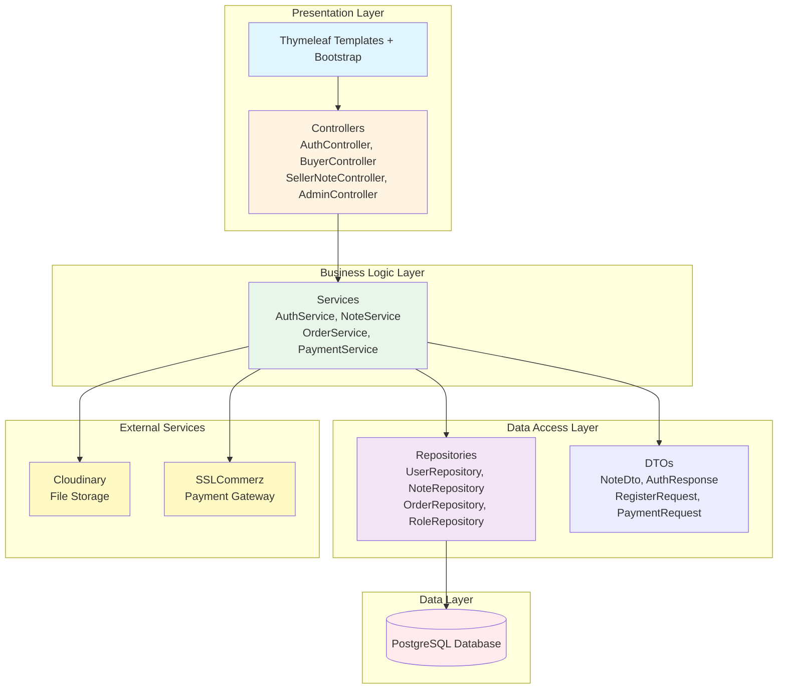
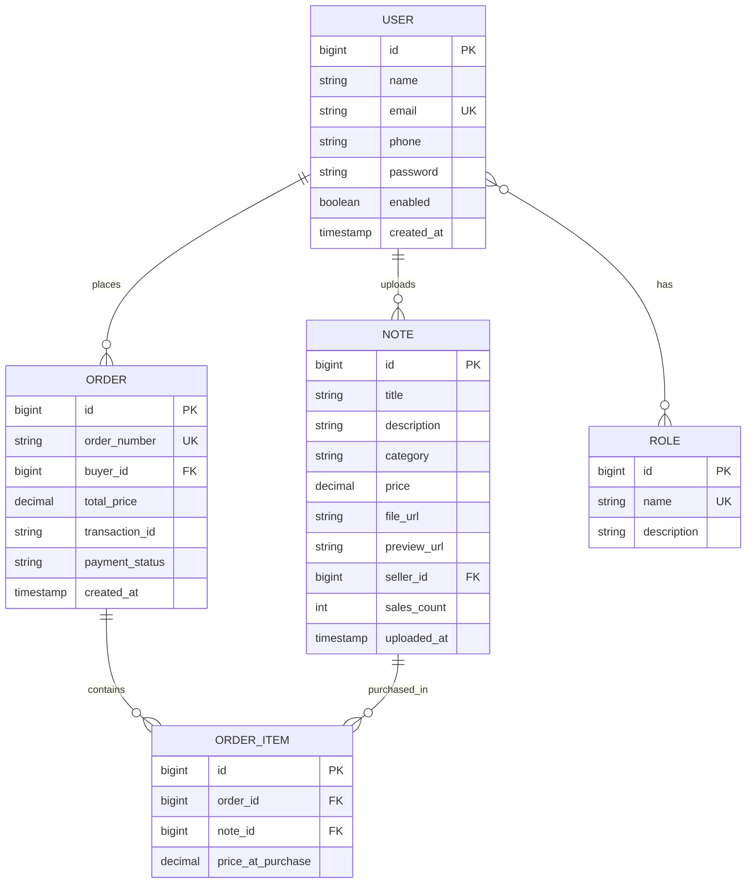

# Digital Notes Marketplace

> A role-based academic marketplace where students can upload, browse, purchase, and download study notes through a secure Spring Boot web platform.


---

## Authors

- **Md Himel**
- **Ariyan Aftab Spandan**

---

## Table of Contents

1. [Project Description](#-project-description)
2. [Architecture Diagram](#-architecture-diagram)
3. [Entity Relationship Diagram](#-entity-relationship-diagram)
4. [API Endpoints](#-api-endpoints)
5. [Design Patterns](#-design-patterns)
6. [Run Instructions](#-run-instructions)
7. [CI/CD Pipeline](#-cicd-pipeline)
8. [Tech Stack](#-tech-stack)

---

## Project Description

Digital Notes Marketplace is a full-stack web application designed to help students share and monetize academic resources in a structured and secure way. The platform allows users to upload notes, explore available study materials, purchase premium content, and download notes after successful payment.

### Role-Based Access Model

The system is built around three distinct user roles:

- **Admin** — Manages users, notes, platform analytics, and administrative operations
- **Seller** — Uploads notes, manages note listings, and monitors note sales
- **Buyer** — Browses notes, places orders, completes payments, and downloads purchased notes

### Key Features

-> Role-based dashboards for Admin, Seller, and Buyer  
-> Secure login and registration (BCrypt password hashing)  
-> Note upload with PDF storage via Cloudinary  
-> Browse, search, and filter notes by category  
-> SSLCommerz payment gateway integration  
-> Order creation and download management  
-> Sales analytics with revenue charts  
-> Profile editing for all user roles  
-> Human-readable order numbers (`ORD-0001`, `ORD-0002`, ...)  

---

## Architecture Diagram

The application follows a **layered architecture** pattern to ensure clean separation of concerns, maintainability, and testability.



### Layer Responsibilities

| Layer | Components | Responsibility |
|-------|-----------|----------------|
| **Presentation** | Controllers, Thymeleaf Templates | Handle HTTP requests, validate input, render views |
| **Business Logic** | Services | Implement business rules, orchestrate workflows |
| **Data Access** | Repositories, DTOs | Manage database operations, map entities to DTOs |
| **External Services** | Cloudinary, SSLCommerz | Handle file storage and payment processing |
| **Data** | PostgreSQL | Persist application data |

### Request Flow

```text
User Request → Controller → Service → Repository → Database
                    ↓           ↓
                  View    External APIs
```

---

## Entity Relationship Diagram

The database schema is designed to support role-based access, note management, order processing, and payment tracking.



### Key Relationships

- **User ↔ Role** (Many-to-Many): Users can have multiple roles (e.g., a user can be both Seller and Buyer)
- **User → Note** (One-to-Many): A seller can upload multiple notes
- **User → Order** (One-to-Many): A buyer can place multiple orders
- **Order → OrderItem** (One-to-Many): An order can contain multiple purchased notes
- **Note → OrderItem** (One-to-Many): A note can be purchased in multiple orders

---

## API Endpoints

### Authentication

| Method | Endpoint | Description | Access |
|--------|----------|-------------|--------|
| POST | `/api/auth/register` | Register new user | Public |
| POST | `/api/auth/login` | Login user | Public |
| POST | `/api/auth/logout` | Logout user | Authenticated |

### Notes Management

| Method | Endpoint | Description | Access |
|--------|----------|-------------|--------|
| GET | `/api/buyer/notes` | List all available notes | Buyer |
| GET | `/api/buyer/notes/search?keyword=...` | Search notes by keyword | Buyer |
| GET | `/api/buyer/notes/filter?category=...` | Filter notes by category | Buyer |
| GET | `/api/buyer/notes/{id}` | Get note details | Buyer |
| POST | `/seller/notes/upload` | Upload new note | Seller |
| PUT | `/seller/notes/{id}` | Update note details | Seller |
| DELETE | `/seller/notes/{id}` | Delete note | Seller |

### Orders & Payments

| Method | Endpoint | Description | Access |
|--------|----------|-------------|--------|
| GET | `/api/buyer/my-orders` | View order history | Buyer |
| GET | `/api/buyer/my-downloads` | View purchased notes | Buyer |
| POST | `/api/payment/initiate` | Initiate payment | Buyer |
| POST | `/api/payment/success` | Payment success callback | SSLCommerz |
| POST | `/api/payment/fail` | Payment failure callback | SSLCommerz |
| POST | `/api/payment/cancel` | Payment cancellation callback | SSLCommerz |

### Admin Operations

| Method | Endpoint | Description | Access |
|--------|----------|-------------|--------|
| GET | `/api/admin/users` | List all users | Admin |
| DELETE | `/api/admin/users/{id}` | Delete user | Admin |
| PUT | `/api/admin/users/{id}/status` | Enable/disable user | Admin |
| GET | `/api/admin/notes` | List all notes | Admin |
| DELETE | `/api/admin/notes/{id}` | Delete note | Admin |
| GET | `/api/admin/analytics` | View platform analytics | Admin |

### Profile Management

| Method | Endpoint | Description | Access |
|--------|----------|-------------|--------|
| GET | `/profile` | View profile | Authenticated |
| POST | `/profile/update` | Update profile | Authenticated |

For complete API documentation, see [API_ENDPOINTS.md](API_ENDPOINTS.md)

---

## Design Patterns

The project implements several software engineering design patterns to ensure code quality, maintainability, and extensibility.

### 1. **Service Layer Pattern**

**Purpose:** Separates business logic from controllers and persistence logic.

**Implementation:**
- `AuthService` — User authentication and registration
- `NoteService` / `NoteServiceImpl` — Note management and search
- `OrderService` / `OrderServiceImpl` — Order creation and retrieval
- `PaymentService` / `PaymentServiceImpl` — Payment gateway integration

**Benefits:**
- Keeps controllers thin and focused on HTTP handling
- Makes unit testing easier with mockable services
- Centralizes business rules in one place

### 2. **Repository Pattern**

**Purpose:** Abstracts database access behind dedicated interfaces.

**Implementation:**
- `UserRepository`, `NoteRepository`, `OrderRepository`, `OrderItemRepository`, `RoleRepository`

**Benefits:**
- Reduces boilerplate persistence code
- Keeps data access separate from business logic
- Enables easy database switching

### 3. **DTO (Data Transfer Object) Pattern**

**Purpose:** Transfers only required data between layers without exposing entity internals.

**Implementation:**
- `NoteDto` — Clean note representation with sales count
- `AuthResponse` — Authentication result with user details
- `RegisterRequest`, `LoginRequest` — Input validation models
- `PaymentRequest` — Payment initiation data
- `AdminUserDto` — User management data

**Benefits:**
- Prevents direct entity exposure
- Keeps API responses clean and predictable
- Supports frontend-friendly payloads

### 4. **MVC (Model-View-Controller) Pattern**

**Purpose:** Separates business data, UI rendering, and request handling.

**Implementation:**
- **Model:** `User`, `Note`, `Order`, `OrderItem`, `Role`
- **View:** Thymeleaf templates in `src/main/resources/templates`
- **Controller:** `AuthController`, `BuyerController`, `SellerNoteController`, `PaymentController`, `AdminController`

**Benefits:**
- Clear separation of concerns
- Easier frontend/backend collaboration
- Simplified testing and maintenance

### 5. **Strategy Pattern**

**Purpose:** Encapsulates interchangeable behaviors behind a common interface.

**Implementation:**
- `PaymentServiceImpl` — Strategy-based payment session initialization
- `NoteServiceImpl` — Strategy objects for different browse modes (all, search, filter)

**Benefits:**
- Supports multiple payment gateways without controller changes
- Makes browse behavior extensible
- Reduces conditional logic in services

### 6. **Factory Pattern**

**Purpose:** Centralizes object or strategy selection.

**Implementation:**
- Payment strategy selection in `PaymentServiceImpl`
- Browse mode factory in `NoteServiceImpl`

**Benefits:**
- Keeps selection logic centralized
- Improves code extensibility
- Reduces coupling

### 7. **Singleton Pattern (Spring Beans)**

**Purpose:** Ensures one shared instance per application context.

**Implementation:**
- All Spring-managed beans (Controllers, Services, Repositories, Configuration classes)

**Benefits:**
- Memory efficiency
- Consistent application-wide behavior
- Simplified dependency injection

---

## Run Instructions

### Prerequisites

- **Java 17+**
- **Maven 3.6+**
- **PostgreSQL 16+** (or use Docker)
- **Git**

### Option 1: Run Locally (Without Docker)

#### 1. Clone the Repository

```bash
git clone <repository-url>
cd notes-marketplace
```

#### 2. Configure Database

Create a PostgreSQL database:

```sql
CREATE DATABASE notesmarketplace;
```

#### 3. Configure Application Properties

Create `src/main/resources/application.yaml`:

```yaml
spring:
  datasource:
    url: jdbc:postgresql://localhost:5432/notesmarketplace
    username: your_db_user
    password: your_db_password
  jpa:
    hibernate:
      ddl-auto: update
    show-sql: true

cloudinary:
  cloud-name: your_cloudinary_cloud_name
  api-key: your_cloudinary_api_key
  api-secret: your_cloudinary_api_secret

sslcommerz:
  store-id: your_sslcommerz_store_id
  store-password: your_sslcommerz_store_password
  base-url: https://sandbox.sslcommerz.com
  success-url: http://localhost:8080/api/payment/success
  fail-url: http://localhost:8080/api/payment/fail
  cancel-url: http://localhost:8080/api/payment/cancel
```

#### 4 Build the Project

```bash
./mvnw clean install
```

#### 5 Run Tests

```bash
./mvnw test
```

#### 6 Start the Application

```bash
./mvnw spring-boot:run
```

#### 7 Access the Application

Open your browser and navigate to: **http://localhost:8080**

**Default Admin Credentials:**
- Email: `admin@gmail.com`
- Password: `admin123`

---

### Option 2: Run with Docker Compose (Recommended)

#### 1 Clone the Repository

```bash
git clone <repository-url>
cd notes-marketplace
```

#### 2 Create `.env` File

Create a `.env` file in the project root:

```env
# Database
POSTGRES_USER=notesuser
POSTGRES_PASSWORD=notespass
POSTGRES_DB=notesmarketplace
SPRING_DATASOURCE_URL=jdbc:postgresql://db:5432/notesmarketplace
SPRING_DATASOURCE_USERNAME=notesuser
SPRING_DATASOURCE_PASSWORD=notespass

# Cloudinary
CLOUDINARY_CLOUD_NAME=your_cloudinary_cloud_name
CLOUDINARY_API_KEY=your_cloudinary_api_key
CLOUDINARY_API_SECRET=your_cloudinary_api_secret

# SSLCommerz
SSLCOMMERZ_STORE_ID=your_sslcommerz_store_id
SSLCOMMERZ_STORE_PASSWORD=your_sslcommerz_store_password
SSLCOMMERZ_BASE_URL=https://sandbox.sslcommerz.com
SSLCOMMERZ_SUCCESS_URL=http://localhost:8080/api/payment/success
SSLCOMMERZ_FAIL_URL=http://localhost:8080/api/payment/fail
SSLCOMMERZ_CANCEL_URL=http://localhost:8080/api/payment/cancel
```

#### 3 Start Services

```bash
docker compose up --build
```

This will:
- Start PostgreSQL 16 on port `5432`
- Build and start the Spring Boot application on port `8080`
- Automatically run database migrations

#### 4 Access the Application

Open your browser and navigate to: **http://localhost:8080**

#### 5 Stop Services

```bash
docker compose down
```

---

## CI/CD Pipeline

### Current Implementation Status

The project is **CI/CD ready** and can be integrated with popular platforms like **GitHub Actions**, **GitLab CI**, or **Jenkins**.

### Recommended CI/CD Workflow

```mermaid
graph LR
    A[Code Push] --> B[Build]
    B --> C[Unit Tests]
    C --> D[Integration Tests]
    D --> E[Code Quality Check]
    E --> F[Build Docker Image]
    F --> G[Push to Registry]
    G --> H[Deploy to Staging]
    H --> I[Deploy to Production]
    
    style A fill:#e1f5ff
    style B fill:#fff4e1
    style C fill:#e8f5e9
    style D fill:#e8f5e9
    style E fill:#f3e5f5
    style F fill:#fff9c4
    style G fill:#ffebee
    style H fill:#e0f2f1
    style I fill:#c8e6c9
```



### Sample GitHub Actions Workflow

Create `.github/workflows/ci-cd.yml`:

```yaml
name: CI/CD Pipeline

on:
  push:
    branches: [ main, develop ]
  pull_request:
    branches: [ main ]

jobs:
  build-and-test:
    runs-on: ubuntu-latest
    
    services:
      postgres:
        image: postgres:16
        env:
          POSTGRES_USER: test
          POSTGRES_PASSWORD: test
          POSTGRES_DB: testdb
        ports:
          - 5432:5432
        options: >-
          --health-cmd pg_isready
          --health-interval 10s
          --health-timeout 5s
          --health-retries 5
    
    steps:
    - uses: actions/checkout@v3
    
    - name: Set up JDK 17
      uses: actions/setup-java@v3
      with:
        java-version: '17'
        distribution: 'temurin'
        cache: maven
    
    - name: Build with Maven
      run: ./mvnw clean install -DskipTests
    
    - name: Run Tests
      run: ./mvnw test
      env:
        SPRING_PROFILES_ACTIVE: test
    
    - name: Generate Test Report
      if: always()
      uses: dorny/test-reporter@v1
      with:
        name: Maven Tests
        path: target/surefire-reports/*.xml
        reporter: java-junit
    
    - name: Build Docker Image
      if: github.ref == 'refs/heads/main'
      run: docker build -t notes-marketplace:${{ github.sha }} .
    
    - name: Push to Docker Registry
      if: github.ref == 'refs/heads/main'
      run: |
        echo "${{ secrets.DOCKER_PASSWORD }}" | docker login -u "${{ secrets.DOCKER_USERNAME }}" --password-stdin
        docker push notes-marketplace:${{ github.sha }}
```

### CI/CD Best Practices Implemented

- **Automated Testing** — JUnit 5 + Mockito integration tests  
- **Test Coverage** — Unit and integration test suites  
- **Dockerization** — Multi-stage Dockerfile for optimized builds  
- **Environment Configuration** — Externalized configuration via `.env`  
- **Database Migrations** — Hibernate auto-update in development, manual migrations recommended for production  
- **Health Checks** — Spring Boot Actuator endpoints available  

### Production Deployment Considerations

- Use managed database services (AWS RDS, Azure Database for PostgreSQL)
- Store secrets in secure vaults (AWS Secrets Manager, HashiCorp Vault)
- Implement blue-green or canary deployment strategies
- Set up monitoring and alerting (Prometheus, Grafana, ELK Stack)
- Configure auto-scaling based on load
- Use SSL/TLS certificates for HTTPS
- Implement rate limiting and DDoS protection

---

## Tech Stack

| Category | Technology |
|----------|-----------|
| **Backend** | Spring Boot 4, Spring MVC, Spring Data JPA, Spring Security |
| **Frontend** | Thymeleaf, Bootstrap 5, HTML, CSS, JavaScript |
| **Database** | PostgreSQL 16 |
| **Testing** | JUnit 5, Mockito, MockMvc, Spring Boot Test, H2 (test DB) |
| **Payment** | SSLCommerz Payment Gateway |
| **File Storage** | Cloudinary |
| **Containerization** | Docker, Docker Compose |
| **Build Tool** | Maven |
| **Java Version** | Java 17 |

---

## Additional Resources

- **API Documentation:** [API_ENDPOINTS.md](API_ENDPOINTS.md)
- **Database Schema:** See [tables.txt](tables.txt)
- **Docker Setup:** [docker-compose.yml](docker-compose.yml)

---

## Academic Value

This project demonstrates practical application of:

- Software design patterns (Service Layer, Repository, Strategy, MVC, Factory, Singleton)
- Layered system architecture with clear separation of concerns
- Secure full-stack web development with Spring Security and BCrypt
- RESTful API design following best practices
- Third-party payment gateway integration (SSLCommerz)
- Comprehensive automated testing and verification
- Containerized deployment with Docker
- Role-based access control (RBAC)
- Database relationship modeling and JPA/Hibernate usage
---

## Support

For questions or issues, please contact the project authors or create an issue in the repository.

---

**Thank You for visiting this project repository.**

---

